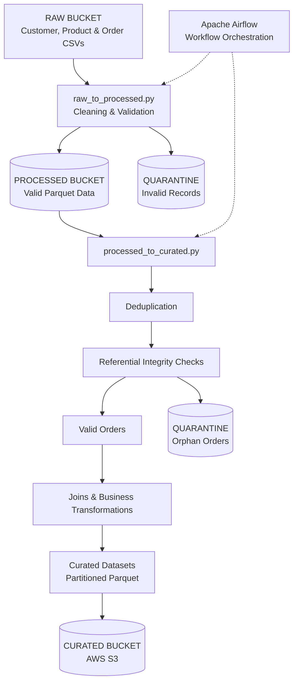

# E-Commerce Data Engineering Pipeline

An end-to-end data engineering project using **PySpark, Apache Airflow, and AWS S3** to build a reliable ETL pipeline for e-commerce customer, product, and order data.

## Architecture & Data Flow

**Orchestration:** Apache Airflow manages task execution and dependencies. The curated stage runs after the raw-to-processed stage succeeds.

## Pipeline Stages

### 1. Raw to Processed

* Reads customer, product, and order CSV files from AWS S3.
* Cleans data, standardizes values, and validates records.
* Separates valid and invalid records.
* Writes valid datasets in Parquet format and invalid records to quarantine locations.

### 2. Processed to Curated

* Removes duplicate records.
* Checks referential integrity between customers, products, and orders.
* Identifies orphan orders referencing missing customers or products.
* Joins datasets and calculates business metrics.
* Produces analytics-ready fact, dimension, and summary datasets.

### 3. Workflow Orchestration

* Uses Apache Airflow to orchestrate PySpark jobs.
* Manages task dependencies and execution order.
* Runs the curated stage after successful processing.

## Curated Outputs (AWS S3)

| Dataset            | Purpose                           |
| ------------------ | --------------------------------- |
| `fact_orders`      | Order-level transactional data    |
| `dim_customers`    | Customer dimension data           |
| `dim_products`     | Product dimension data            |
| `customer_metrics` | Customer-level analytical metrics |
| `product_metrics`  | Product-level analytical metrics  |
| `sales_summary`    | Aggregated sales insights         |

## Technologies Used

* **Python & PySpark** – Data cleaning, validation, joins, and aggregations
* **Apache Airflow** – Workflow orchestration and task dependencies
* **AWS S3** – Storage for raw, processed, quarantine, and curated data
* **Parquet** – Efficient columnar storage format

## Key Features

* Data quality validation and invalid-record quarantine
* Duplicate detection and removal
* Referential integrity checks
* Multi-stage ETL processing
* Analytics-ready fact and dimension datasets
* Automated workflow orchestration with Airflow

## Execution

Run the PySpark jobs individually using `spark-submit` or trigger the complete workflow through the Apache Airflow DAG.

## Outcome

A structured, quality-checked e-commerce data pipeline that transforms raw CSV files into curated datasets ready for downstream analytics and reporting.
